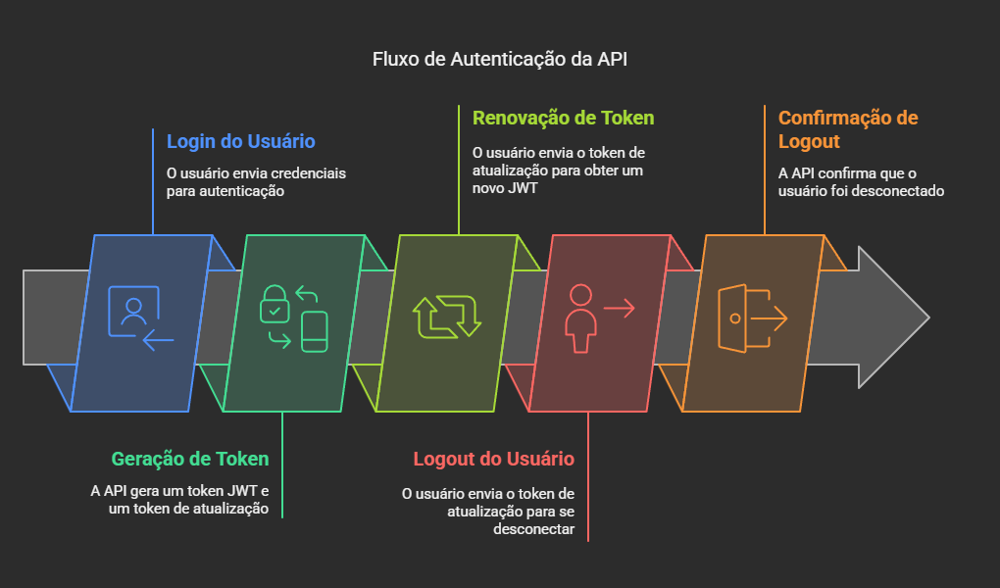

# Projeto Back-End de E-commerceB2B [](https://spring.io/projects/spring-boot) [](https://redis.io/docs/latest/) [](https://www.postgresql.org/)
 
É um projeto Back-End E-commerce B2B desenvolvido com Spring Boot, Spring Security, OAuth2, JWT, SQL (PostgreSQL), NoSQL(Redis). assim empresas e funcionários podem ter acessos seguros e controle refinado de permissões, assim o projeto oferece segurança para a empresa

## Tecnologias Utilizadas

- *Java*: Linguagem de programação principal.
- *Spring Boot*: Framework para criar aplicações Java.
- *Spring Security*: Framework para segurança e autenticação.
- *JWT (JSON Web Tokens)*: Para autenticação baseada em tokens.
- *PostgreSQL*: Banco de dados relacional.
- *Redis*: Armazenamento de dados em memória, usado para gerenciar tokens de atualização.
- *Maven*: Gerenciador de dependências e build.
- *Flyway*: Ferramenta de migração de banco de dados.


## Fluxo do projeto



1. *Autenticação*:
   - O usuário envia suas credenciais (username e password) para o endpoint /authenticate.
   - A API autentica o usuário usando AuthenticationManager.
   - Se as credenciais forem válidas, a API gera um token JWT e um token de atualização.
   - A resposta contém o token JWT, o token de atualização e o email do usuário.

2. *Renovação de Token*:
   - O usuário envia um token de atualização para o endpoint /refresh-token.
   - A API verifica a validade e a expiração do token de atualização.
   - Se o token for válido, a API gera um novo token JWT e o retorna.

3. *Logout*:
   - O usuário envia um token de atualização para o endpoint /logout.
   - A API verifica a validade do token de atualização.
   - Se o token for válido, a API remove o token de atualização do armazenamento, efetivamente deslogando o usuário.

## Exemplo do Fluxo de Autenticação

**Login**

Requisição

```json
{
  "username": "user1",
  "password": "password123"
}

```

Resposta

```json
{
  "jwt": "eyJhbGciOiJIUzI1NiIsInR5cCI6IkpXVCJ9...",
  "refreshToken": "dGhpc2lzYXJlZnJlc2h0b2tlbg==",
  "email": "user1@example.com"
}

```

**Renovação de Token**

Requisição

```json

{
  "token": "refresh-token"
}

```

Resposta

```json

{
  "jwt": "eyJhbGciOiJIUzI1NiIsInR5cCI6IkpXVCJ9..."
}

```

**Logout**

Requisição

```json

{
  "token": "expiredToken"
}

```

Resposta

```json

{
  "message": "Logout successful"
}

```


